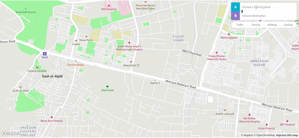

<p align="right">
  <a href="https://npmjs.org/package/react-map-gl">
    
  </a>
  <a href="https://travis-ci.com/visgl/react-map-gl">
    
  </a>
  <a href="http://badges.mit-license.org">
    
  </a>
</p>

<h1 align="center">react-map-gl-directions | <a href="https://github.com/neeleshbisht99/react-map-gl-directions/blob/master/README.md">Docs</a></h1>

> react-map-gl-directions is a [React](http://facebook.github.io/react/) wrapper for
> [Mapbox GL Directions](https://github.com/mapbox/mapbox-gl-directions) for use with [react-map-gl](https://github.com/visgl/react-map-gl).

<!--
***INSERT ANOTHER GRAPHIC HERE***

[]()

- Most people will glance at your `README`, *maybe* star it, and leave
- Ergo, people should understand instantly what your project is about based on your repo

> Tips

- HAVE WHITE SPACE
- MAKE IT PRETTY
- GIFS ARE REALLY COOL
> GIF Tools

- Use <a href="http://recordit.co/" target="_blank">**Recordit**</a> to create quicks screencasts of your desktop and export them as `GIF`s.
- For terminal sessions, there's <a href="https://github.com/chjj/ttystudio" target="_blank">**ttystudio**</a> which also supports exporting `GIF`s.

**Recordit**


**ttystudio**


---
-->

## Table of Contents

- [Installation](#installation)
- [Styling](#styling)
- [Features](#features)
- [Example](#example)
- [Support](#support)
- [License](#license)

## Installation

Using `react-map-gl-directions` requires `react >= 16.3`.

```sh
npm install --save react-map-gl-directions
```

## Styling

Import:

```js
import 'react-map-gl-directions/dist/mapbox-gl-directions.css'
```

or

Link tag in header:

```html
<link
  href="https://api.mapbox.com/mapbox-gl-js/plugins/mapbox-gl-directions/v4.0.0/mapbox-gl-directions.css"
  rel="stylesheet"
/>
```

## Features

Only `mapRef` and `mapboxApiAccessToken` are required.

| Name                   | Type     | Default                   | Description                                                                                                                                                                                               |
| ---------------------- | -------- | ------------------------- | --------------------------------------------------------------------------------------------------------------------------------------------------------------------------------------------------------- |
| mapRef                 | Object   |                           | Ref for react-map-gl map component.                                                                                                                                                                       |
| mapboxApiAccessToken   | String   |                           | https://www.mapbox.com/                                                                                                                                                                                   |
| position               | String   | "top-right"               | Position on the map to which the directions plugin control will be added. Valid values are `"top-left"`, `"top-right"`, `"bottom-left"`, and `"bottom-right"`.                                            |
| api                    | String   |                           | Override default ("https://api.mapbox.com/directions/v5/") routing endpoint url.                                                                                                                          |
| interactive            | Boolean  | true                      | Enable/Disable mouse or touch interactivity from the plugin.                                                                                                                                              |
| profile                | String   | "mapbox/driving-traffic"  | Routing profile to use. Options: mapbox/driving-traffic, mapbox/driving, mapbox/walking, mapbox/cycling.                                                                                                  |
| styles                 | Array    |                           | Override default layer properties of the directions source. Documentation for each property are specified in the <a href="https://docs.mapbox.com/mapbox-gl-js/style-spec/">Mapbox GL Style Reference</a> |
| alternatives           | Boolean  | false                     | Whether to enable alternatives.                                                                                                                                                                           |
| congestion             | Boolean  | false                     | Whether to enable congestion along the route line.                                                                                                                                                        |
| unit                   | String   | "imperial"                | Measurement system to be used in navigation instructions. Options: imperial, metric.                                                                                                                      |
| compile                | Function | null                      | Provide a custom function for generating instruction, compatible with osrm-text-instructions.                                                                                                             |
| geocoder               | Object   |                           | Accepts an object containing the query parametres as <a href="https://docs.mapbox.com/api/#search-for-places">documented here</a>.                                                                        |
| controls               | Object   |                           | Hide or display inputs, instructions and profile switch controls.                                                                                                                                         |
| zoom                   | Number   | 16                        | If no bbox exists from the geocoder result, the zoom you set here will be used in the flyTo.                                                                                                              |
| placeholderOrigin      | String   | "Choose a starting place" | If set, this text will appear as the placeholder attribute for the origin input element.                                                                                                                  |
| placeholderDestination | String   | "Choose destination"      | If set, this text will appear as the placeholder attribute for the destination input element.                                                                                                             |
| flyTo                  | Boolean  | true                      | If false, animating the map to a selected result is disabled.                                                                                                                                             |
| exclude                | String   | null                      | Exclude certain road types from routing. The default is to not exclude anything. Options: ferry, toll, motorway.                                                                                          |
| onInit                 | Function | () => {}                  | Is passed Mapbox directions instance as param and is executed after Mapbox directions plugin is initialized.                                                                                              |
| onClear                | Function | () => {}                  | Is passed `{ type: }` as a param and type is one of 'origin' or 'destination'. Fired when input is cleared.                                                                                               |
| onLoading              | Function | () => {}                  | Is passed `{ type: }` as a param and type is one of 'origin' or 'destination'. Fired when either origin or destination is loading.                                                                        |
| onOrigin               | Function | () => {}                  | Is passed `{ feature }` Fired when origin is set.                                                                                                                                                         |
| onDestination          | Function | () => {}                  | Is passed `{ feature }` Fired when destination is set.                                                                                                                                                    |
| onProfile              | Function | () => {}                  | Is passed `{ profile }` Profile is one of 'driving', 'walking', or 'cycling'. Fired when profile is set.                                                                                                  |
| onRoute                | Function | () => {}                  | Is passed `{ route }` Fired when a route is updated                                                                                                                                                       |
| onError                | Function | () => {}                  | Is passed `{ error }` as a param. Error as string.                                                                                                                                                        |

## Example

```js
import 'mapbox-gl/dist/mapbox-gl.css'
import 'react-map-gl-directions/dist/mapbox-gl-directions.css'
import React, { Component } from 'react'
import MapGL from 'react-map-gl'
import Directions from 'react-map-gl-directions'

function getAccessToken() {
  var accessToken = null

  if (typeof window !== 'undefined' && window.location) {
    var match = window.location.search.match(/access_token=([^&\/]*)/)
    accessToken = match && match[1]
  }

  if (!accessToken && typeof process !== 'undefined') {
    // Note: This depends on bundler plugins (e.g. webpack) inmporting environment correctly
    accessToken = accessToken || process.env.MapboxAccessToken // eslint-disable-line
  }

  return accessToken || null
}

// Ways to set Mapbox token: https://uber.github.io/react-map-gl/#/Documentation/getting-started/about-mapbox-tokens
const MAPBOX_TOKEN = getAccessToken()

class Example extends Component {
  state = {
    viewport: {
      latitude: 37.7577,
      longitude: -122.4376,
      zoom: 8,
    },
  }

  mapRef = React.createRef()

  handleViewportChange = (viewport) => {
    this.setState({
      viewport: { ...this.state.viewport, ...viewport },
    })
  }

  render() {
    return (
      <MapGL
        ref={this.mapRef}
        {...this.state.viewport}
        width="100%"
        height="100%"
        onViewportChange={this.handleViewportChange}
        mapboxApiAccessToken={MAPBOX_TOKEN}>
        <Directions mapRef={this.mapRef} mapboxApiAccessToken={MAPBOX_TOKEN} />
      </MapGL>
    )
  }
}

export default Example
```



## Support

Reach out to me at one of the following places!

- Linkedin at <a href="https://www.linkedin.com/in/neelesh-bisht-398061b4/" target="_blank">`Neelesh Bisht`</a>
- Mail at <a href="mailto:neelesbisht99@gmail.com" target="_blank">`neeleshbisht99@gmail.com`</a>
- Twitter at <a href="https://twitter.com/neeleshbisht99" target="_blank">`@neeleshbisht99`</a>

## License

[](http://badges.mit-license.org)

- **[MIT license](http://opensource.org/licenses/mit-license.php)**
- Copyright 2020 © <a href="https://github.com/neeleshbisht99/react-map-gl-directions" target="_blank">Neelesh Bisht</a>.
